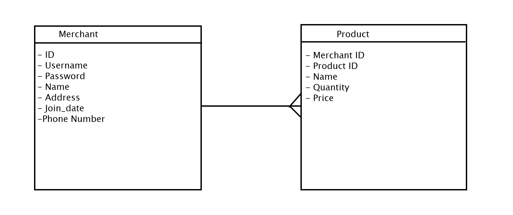

#Microservices Architecture


The picture is a rough explanation of the microservices architecture


#ERD



The picture is ERD of my merchant services that display what's the relationship between two databases.

#Merchant
*# Merchant Object
```
{
    id: integer,
    username: string,
    name: string,
    address: string,
    phone_number: string,
}

**Post/Register**

Input all merchant/user information
* ** URL Params**
None
* ** Data Params**
None
